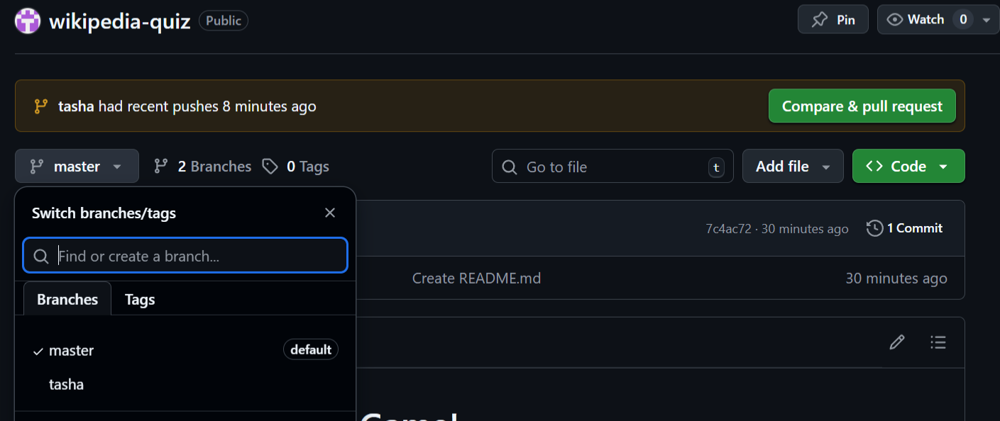
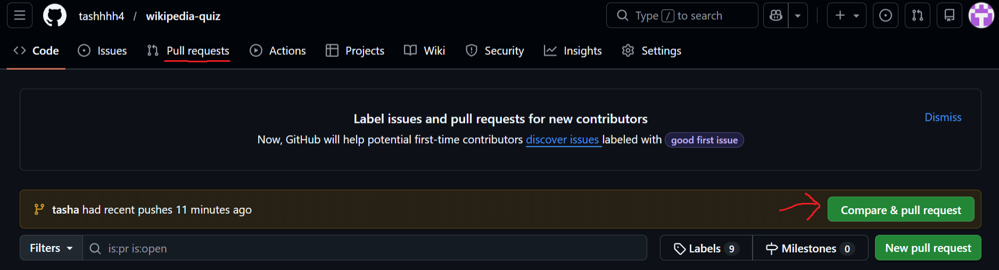
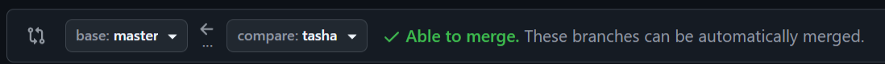

# Lern-Quiz
The Wikipedia Quiz Game

A WIP Hackathon Project

https://github.com/tashhhh4/wikipedia-quiz

## Wie du die Repo clonen kannst

command im Terminal: git clone + url key https
copy https key url in github (unter button "code") 

--> cd filename 
--> command: git status (check your files)
--> command: git add 
--> command: git commit -m " " 
--> command: git push

## Wie du einen Pull-Request machst

You can see the branches that exist:

`git branch`
`git branch -a`

When you first clone the git repository, you'll probably be in the `master` branch. You want to change to a new branch:

`git checkout -b tasha`

Push to a *new upstream branch* by doing this:

`git push --set-upstream origin tasha`

Now you should see your branch available on GitHub:

Click on Compare & pull request

On the next page this part shows exactly which branch will be merged. You want `master` on the left and your branch on the right as shown:

Then scroll down a bit and click the big green "Create Pull Request" button!

# Pulling from master
When you are on your personal branch and you want to bring your project up to date:

Check that you are already in your personal branch:
`git branch`

`git pull origin master`